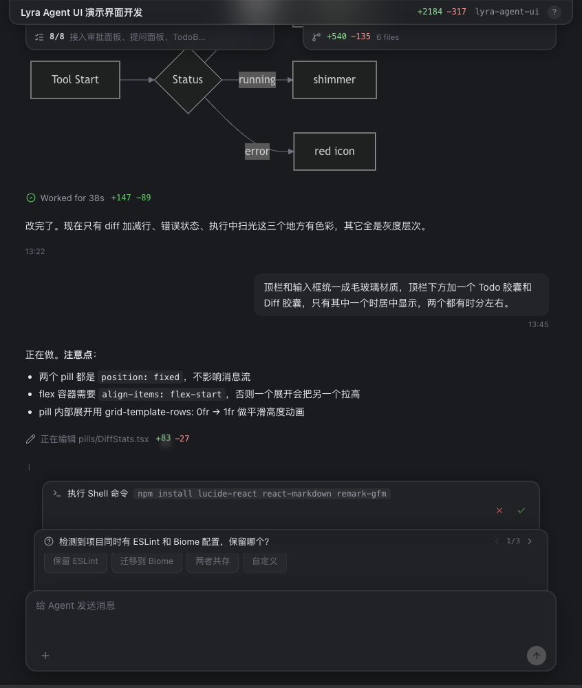
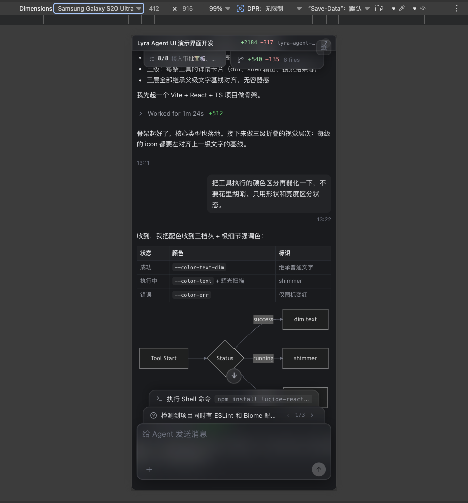
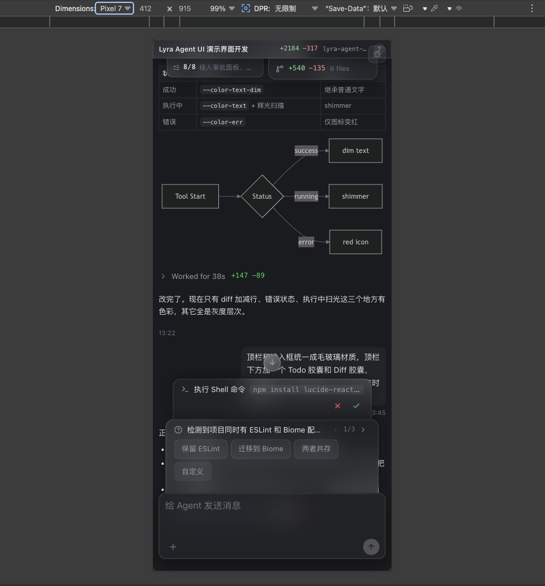

# Lyra Agent UI Demo

面向 Coding Agent / AI IDE 的 React UI 框架与演示工程。

[English](./README.en.md) · [接入指南](./INTEGRATION.md) · [架构说明](./ARCHITECTURE.md) · [API](./API.md) · [贡献指南](./CONTRIBUTING.md)


Lyra Agent UI Demo 提供一套可复用的 Agent 聊天界面：它不绑定任何后端协议，而是通过 `DataProviderValue` 接收应用层整理好的会话状态。你可以把它作为完整 demo 运行，也可以把它作为 UI 框架接入自己的真实 Agent 后端。

## 预览

<p align="center">
  
</p>

<p align="center">
  
  
</p>

## 适合做什么

- 给 Coding Agent、AI IDE、自动化开发助手做聊天与工具执行界面。
- 展示 Agent 思考、搜索、读文件、编辑、Shell、Web、任务计划等过程。
- 在输入框上方展示权限申请、决策问题和实时操作反馈。
- 用作内部产品原型、Agent UI 框架起点，或 GitHub 开源 demo。

## 核心能力

- **三级折叠工具流**：工具组、单次工具调用、具体输出/ diff 分层展示。
- **真实接入边界**：所有 UI 通过 `DataProviderValue` 消费数据，不直接依赖 mock。
- **富文本输出**：支持 GFM Markdown、代码高亮、Mermaid 图表和流式文本。
- **权限与决策面板**：支持 approve / deny，以及多选项 decision prompt。
- **会话状态胶囊**：顶部浮动 Todo 与 Diff 摘要，适合长任务进度感知。
- **可发布包结构**：主入口只暴露生产 API，mock 数据隔离在 `lyra-agent-ui-demo/mock`。
- **细节交互**：折叠 hover、流式 shimmer、数字滚动、滚动跟随阈值、可复制区域控制。

## 快速开始

```bash
npm install
npm run dev
```

常用验证命令：

```bash
npm run lint
npm run build
npm run build:lib
npm pack --dry-run
```

## 作为 UI 框架接入

生产接入只需要使用主入口和样式入口：

```tsx
import "lyra-agent-ui-demo/styles.css";
import {
  AgentChatApp,
  createDataProviderValue,
  type ChatMessage,
} from "lyra-agent-ui-demo";
```

把你的后端状态整理成 `DataProviderValue`：

```tsx
const data = createDataProviderValue({
  session: {
    title: "My Agent",
    project: "my-project",
    totalAdditions: 0,
    totalDeletions: 0,
  },
  messages,
  async sendMessage(text) {
    await sendToBackend(text);
  },
});

return <AgentChatApp data={data} />;
```

Demo 数据是独立子入口，只应在演示或本地开发中使用：

```tsx
import { MockDataProvider } from "lyra-agent-ui-demo/mock";
```

生产项目不应从 `lyra-agent-ui-demo/mock` 导入内容。

## 包结构

```text
src/
├── AgentChatApp.tsx       # 可复用 UI Shell
├── App.tsx                # 本地 demo 入口
├── index.ts               # 生产公共 API
├── mock.ts                # demo/mock 子入口
├── core/                  # 类型、配置、i18n
├── data/                  # DataProviderValue 与数据工具
├── features/              # chat / tools / rich-text / panels / pills
├── components/            # 共享视觉组件
├── hooks/                 # UI hooks
└── styles/                # tokens 与运行时 guard
```

库构建输出：

- `dist-lib/index.js` / `index.cjs` / `index.d.ts`
- `dist-lib/mock.js` / `mock.cjs` / `mock.d.ts`
- `dist-lib/agent-chat-demo.css`

`dist/` 和 `dist-lib/` 是生成产物，已被 git 忽略。

## 文档

- [接入指南](./INTEGRATION.md)：如何连接真实后端。
- [架构说明](./ARCHITECTURE.md)：数据流、公共 API 边界、模块组织。
- [API 参考](./API.md)：导出组件、类型、子路径和稳定性规则。
- [贡献指南](./CONTRIBUTING.md)：本地开发、检查命令和公共 API 规范。
- [许可证](./LICENSE)：Apache-2.0。

## 标签

`agent-ui` · `coding-agent` · `ai-ide` · `react` · `typescript` · `vite` · `chat-ui` · `developer-tools`

## License

Apache-2.0
